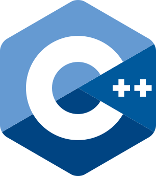
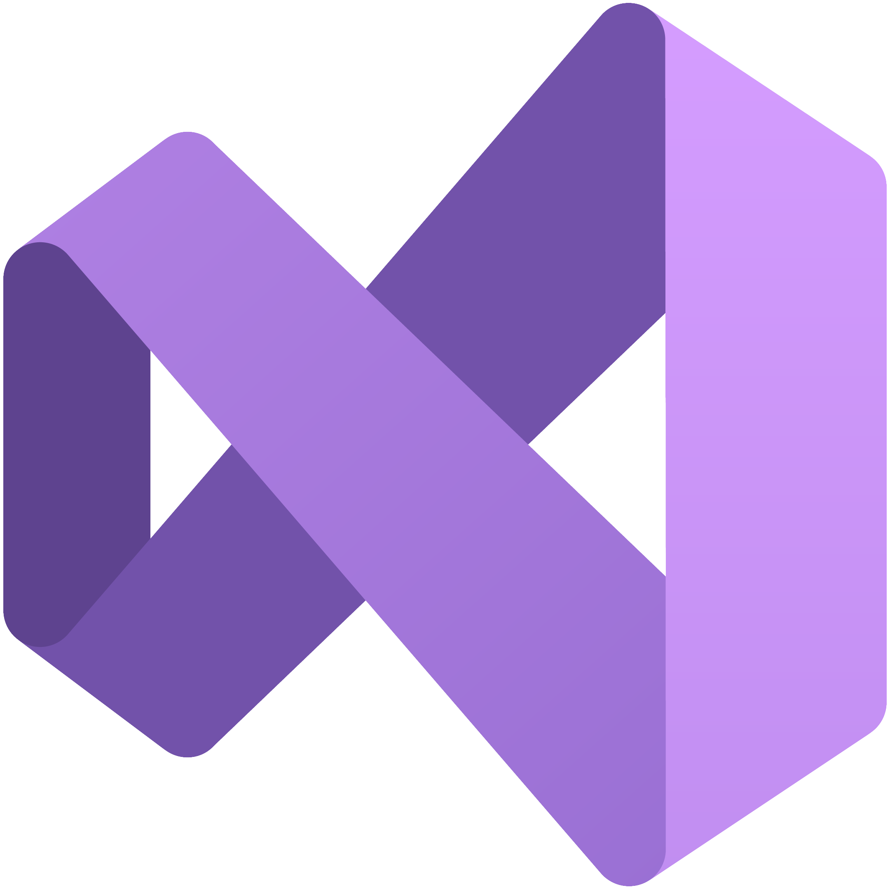
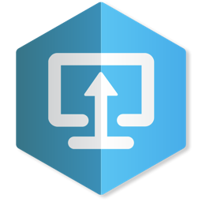

# 👋 Hi, I'm Zhangir 

🎓 I'm a 3rd year student at Breda University of Applied Sciences in Creative Media and Game Technologies.

💼 I'm a Tools Developer intern at SportsImproVR.

I am skilled in **Engine and Tools** programming with strong experience in making custom engines. I enjoy **creating tools and systems** which help other disciplines streamline game development. I’m passionate about **solving technical challenges** and continuously improving my skills.

Proficient in C++. Additional experience with Unreal, Unity, and Godot.

Hobbies: writing stories, calisthenics, designing in Photoshop.

# ⚙️ Skills

  

    
    

      C++ 
      8 years of experience in C++
    

  

  

    
    

      Visual Studio 
      4 years of experience. Familiar with debugging, profiling, and project configuration tools
    

  

  

    
    

      Visual Studio Code 
    

  

  

    
    

      Github   
      3 years of experience. Experienced with its pipelines and used them in a team environment, including reviews, automated checks, and managing branches.
    

  

  

    
    

      Perforce   
      2 years of experience with Perforce and P4V in a collaborative team environment, including active participation in code reviews.
    

  

  

    
    

      Unreal Engine  
      Familiar working with Unreal Engine's Blueprints and in C++.
    

  

  

    
    

      Unity C#  
      Familiar working with Unity and in C#
    

  

# 💼 My Professional Experience

  
  
    
      

        
          
        

        <h2>
          <a href="{{ job.url }}" class="project-title-link">{{ job.title }}</a>
        </h2>

        
<strong>Date:</strong> {{ job.date | date: "%B %-d, %Y" }}

        
          
<strong>Company:</strong> {{ job.company }}

        

        
          
<strong>Work Type:</strong> {{ job.work_type }}

        

        
          
{{ job.description }}

        
        
        
<a href="{{ job.url }}" class="read-more-link">Read more →</a>

        
          
<strong>My Contributions:</strong> {{ job.contributions }}

        

        
          
<strong>Tools:</strong> {{ job.tools }}

        

        
          
<strong>Team Size:</strong> {{ job.team_size }}

        

        
          
<strong>Duration:</strong> {{ job.duration }}

        
      

    
  

 

# 🚀 My Projects

  
  
    
      

        
          
        

        <h2>
          <a href="{{ project.url }}" class="project-title-link">{{ project.title }}</a>
        </h2>

        
<strong>Date:</strong> {{ project.date | date: "%B %-d, %Y" }}

        
          
{{ project.description }}

        
        
        
<a href="{{ project.url }}" class="read-more-link">Read more →</a>

        
          
<strong>My Contributions:</strong> {{ project.contributions }}

        

        
          
<strong>Engine/Tools:</strong> {{ project.tools }}

        

        
          
<strong>Team Size:</strong> {{ project.team_size }}

        

        
          
<strong>Platforms:</strong> {{ project.platforms }}

        

        
          
<strong>Duration:</strong> {{ project.duration }}

        

      

    
  

